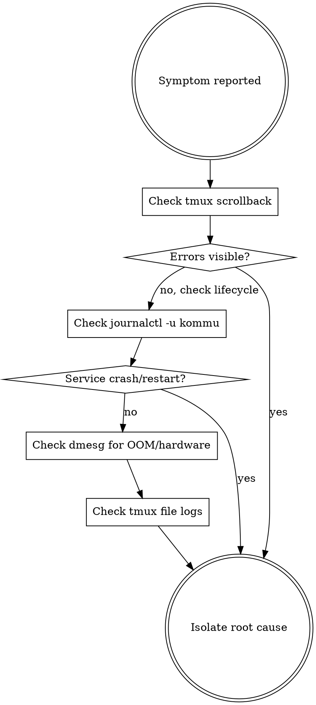

# KA2 Debug Logs

Systematic debugging of KA2 using tmux scrollback and systemd journal logs.

## Log Sources

| Source | What it captures | Access |
|--------|-----------------|--------|
| **tmux scrollback** | All stdout/stderr from `kommu` service processes | `tmux capture-pane -t 0 -S - -p` |
| **systemd journal** | Service lifecycle, crashes, restarts, OOM kills | `journalctl -u kommu` |
| **tmux file logs** | Persisted tmux output (if `TmuxLogsEnabled=True`) | `/data/media/0/realdata/tmux/tmux-*.log` |
| **loggerd segments** | Driving data logs | `/data/media/0/realdata/` |
| **kernel log** | Kernel messages, hardware errors | `dmesg` |

## Debug Workflow



## tmux Scrollback

The `kommu` tmux session runs all openpilot processes. The scrollback buffer can be very large (thousands of lines). **Never dump the full scrollback unfiltered** — it will exceed output limits and get truncated.

```powershell
# ALWAYS start with a targeted query, not a full dump:

# Search for errors (preferred first step)
ssh Kommu "tmux capture-pane -t 0 -S - -p | grep -iE 'error|fail|crash|traceback|exception|killed|segfault'"

# Last N lines only
ssh Kommu "tmux capture-pane -t 0 -S - -p | tail -100"

# Grep + context (show 5 lines around each match)
ssh Kommu "tmux capture-pane -t 0 -S - -p | grep -iE -C 5 'error|traceback'"

# Check if system is healthy — look for process list line containing:
# logmessaged, pandad, thermald, tombstoned, updated, uploader, statsd, streamdatad
ssh Kommu "tmux capture-pane -t 0 -S - -p | grep -i 'logmessaged.*pandad'"

# If you absolutely need the full scrollback, write to a file first:
ssh Kommu "tmux capture-pane -t 0 -S - -p > /tmp/tmux-scrub.txt && wc -l /tmp/tmux-scrub.txt"
# Then read specific sections with head/tail/sed
```

**If grep returns too much output**, narrow the pattern:
- Add a process name: `grep 'controlsd.*error'`
- Add a time window: capture to file, then `sed -n '/10:00/,/10:05/p'`
- Use `wc -l` to check size before reading

## systemd Journal

The `kommu` systemd service manages the openpilot manager:

```powershell
# Recent service logs
ssh Kommu "journalctl -u kommu --no-pager -n 100"

# Since boot
ssh Kommu "journalctl -u kommu --no-pager -b"

# Since a specific time
ssh Kommu "journalctl -u kommu --no-pager --since '10 min ago'"

# Only errors
ssh Kommu "journalctl -u kommu --no-pager -p err"

# Crash loop detection — look for repeated start/stop cycles
ssh Kommu "journalctl -u kommu --no-pager -n 200 | grep -E 'Started|Stopped|Failed|OOM|killed'"

# Check for OOM kills
ssh Kommu "journalctl --no-pager -k | grep -i 'oom\|killed process'"

# All failed units
ssh Kommu "systemctl --failed"

# Service status
ssh Kommu "systemctl status kommu"
```

## tmux File Logs

If `TmuxLogsEnabled` param is set to `True`, tmux output is persisted to `/data/media/0/realdata/tmux/`. The `tmuxledd` process auto-rotates when total size exceeds **10MB**, deleting oldest files first. Individual files can easily contain **thousands of lines** — always treat them as large files.

```powershell
# List available tmux logs with sizes
ssh Kommu "ls -lhS /data/media/0/realdata/tmux/tmux-*.log 2>/dev/null | head -10"

# Check total size and line count
ssh Kommu "wc -l /data/media/0/realdata/tmux/tmux-*.log 2>/dev/null"

# Read most recent log — use tail, never cat a whole file
ssh Kommu "tail -200 /data/media/0/realdata/tmux/tmux-*.log 2>/dev/null"

# Search for errors — ALWAYS limit results:
ssh Kommu "grep -iE 'error|fail|traceback|exception' /data/media/0/realdata/tmux/tmux-20260530--120000.log | head -30"

# Count matches before reading (avoids dumping thousands of lines):
ssh Kommu "grep -ciE 'error|fail|traceback' /data/media/0/realdata/tmux/tmux-20260530--120000.log"

# Narrow the pattern — add a process name:
ssh Kommu "grep 'controlsd' /data/media/0/realdata/tmux/tmux-20260530--120000.log | grep -iE 'error|fail' | head -20"

# Extract a time window (logs have HH:MM:SS timestamps):
ssh Kommu "sed -n '/10:00:00/,/10:05:00/p' /data/media/0/realdata/tmux/tmux-20260530--120000.log | head -50"

# Check if tmux logging is enabled
ssh Kommu "cat /data/params/d/TmuxLogsEnabled 2>/dev/null"

# Enable tmux logging
ssh Kommu "sudo -u kommu python3 -c \"from openpilot.common.params import Params; Params().put('TmuxLogsEnabled', 'True')\""

# Log level: 'all' (default) or 'errors' only
ssh Kommu "cat /data/params/d/TmuxLogLevel 2>/dev/null"
```

**Handling large files:**
1. Check size first: `wc -l` or `ls -lh`
2. Count matches before reading: `grep -c`
3. Always pipe to `head -N` to cap output
4. Narrow patterns: add process name, error type, or time window
5. If still too large, extract to a temp file and read in chunks

## Kernel Log

```powershell
# Recent kernel messages
ssh Kommu "dmesg -T | tail -50"

# Hardware errors
ssh Kommu "dmesg -T | grep -iE 'error|fail|hardware|npu|thermal'"

# Memory pressure
ssh Kommu "dmesg -T | grep -i 'oom\|low memory\|pressure'"

# NPU errors
ssh Kommu "dmesg -T | grep -i 'rk_npu\|npu\|rknpu'"
```

## Process-Specific Debugging

```powershell
# Check which processes are running
ssh Kommu "ps aux | grep -E 'manager|controlsd|modeld|camerad|boardd|pandad'"

# Memory usage of openpilot processes
ssh Kommu "ps aux --sort=-%mem | head -20"

# Disk space (common cause of loggerd failures)
ssh Kommu "df -h /data /data/media"

# Check for stuck/zombie processes
ssh Kommu "ps aux | grep -E 'Z|defunct'"
```

## Common Issues

| Symptom | Likely cause | Command |
|---------|-------------|---------|
| Process missing from tmux | Manager not running or crashed | `journalctl -u kommu --no-pager -n 50` |
| `controls_allowed` false | Panda safety mode | `tmux capture-pane -t 0 -S - -p \| grep -i panda` |
| NPU inference failures | NPU driver or model load error | `dmesg -T \| grep -i npu` |
| Crash loop | OOM or dependency failure | `journalctl -u kommu --no-pager -n 200 \| grep -E 'OOM|killed|Failed'` |
| Slow or laggy | CPU offlining or thermal throttle | `cat /sys/devices/system/cpu/cpu{5,6,7}/online` |
| No camera frames | camerad crash or hardware | `tmux capture-pane -t 0 -S - -p \| grep -i camerad` |
| Upload failures | Network or server auth | `journalctl -u kommu --no-pager \| grep -i uploader` |

## Rules

- **Never dump full tmux scrollback or cat a full log file** — always grep, tail, or use a line range
- Always check tmux scrollback first — it shows real-time process output
- Use `journalctl -u kommu` for service lifecycle issues (crashes, restarts, OOM)
- Use `dmesg` for hardware-level issues (NPU, thermal, memory)
- tmux file logs only exist if `TmuxLogsEnabled=True` — enable before reproducing an issue
- When reporting findings, include timestamps and relevant context, not just error lines

## See Also

- **ka2-ssh** for connection details and basic commands
- **ka2-sync** for deploying fixes
